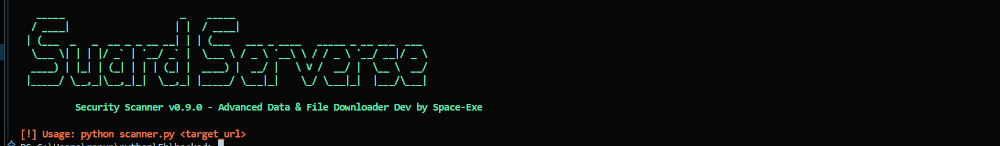
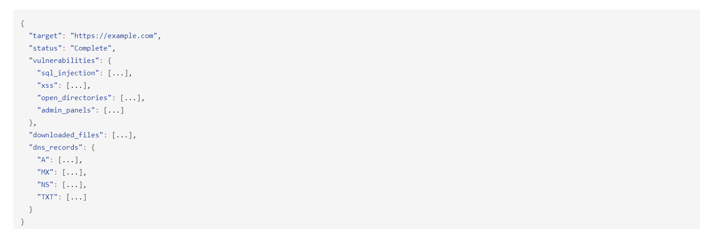

# Advanced Data & File Downloader  🛡️ Security Scanner

> An advanced Python-based security tool for vulnerability scanning, reconnaissance, file downloading, and penetration testing automation.

[](https://github.com/ShiboshreeRoy/Advanced-Data-File-Downloader-Security-Scanner.git)
[](https://github.com/ShiboshreeRoy/Advanced-Data-File-Downloader-Security-Scanner.git)
[](https://github.com/ShiboshreeRoy/Advanced-Data-File-Downloader-Security-Scanner.git)
[](https://github.com/ShiboshreeRoy/Advanced-Data-File-Downloader-Security-Scanner.git)

> 🚨 This tool is made for cybersecurity professionals. Please use responsibly and with authorization.

---

## 📖 Description

**Security Scanner** is a modular, command-line-based Python tool designed for **ethical hackers**, **penetration testers**, and **red teamers**. It automates common web reconnaissance tasks such as **subdomain enumeration**, **DNS lookups**, **SQL/XSS testing**, **admin panel detection**, **login brute-forcing**, and **file downloads** from exposed directories. It exports clean **JSON reports** and supports wordlists for brute-force attacks, making it ideal for both quick assessments and deep analysis.

---

## 🧬 Version History

| Version   | Description |
|-----------|-------------|
| **v0.0**  | Prototype: Basic URL crawler and raw HTML saver. No automation. |
| **v2.0**  | Core scanner modules added: SQLi, XSS, admin panel discovery, open directories. |
| **v0.9.0** | Full-featured release with DNS recon, file downloader, brute-force login engine, JSON export, and CLI UX improvements. |

---

## 🌐 Live Demo (Coming Soon)

**🔗** [Advanced-Data-File-Downloader-Security-Scanner](https://github.com/ShiboshreeRoy/Advanced-Data-File-Downloader-Security-Scanner.git)

---

## 🚀 Features

- 🔍 **Web Reconnaissance** — Crawl & extract internal links and URLs
- 🛡️ **Vulnerability Scanner** — SQLi, XSS, admin panel detection, open directories
- 🔐 **Login Brute-force** — Username/password cracking via wordlists
- 🌐 **DNS & Subdomain Scanner** — A, MX, NS, TXT records + subdomain brute force
- 📥 **File Downloader** — Download common sensitive file types (e.g. `.env`, `.bak`, `.sql`)
- 📄 **Report Exporting** — Timestamped `.json` output for structured analysis
- 🎨 **Interactive CLI** — Colored terminal UI for better module visibility and separation

---

## 📷 Screenshots

> Place images in an `assets/` folder to view properly.

| Terminal UI                      | Sample JSON Report              |
|----------------------------------|----------------------------------|
|  |  |

---

## 🛠️ Installation

Clone the repository:

```bash
git clone https://github.com/ShiboshreeRoy/Advanced-Data-File-Downloader-Security-Scanner.git
cd Advanced-Data-File-Downloader-Security-Scanner
```

Install Python dependencies:

```bash
pip install -r requirements.txt
```

---

## ▶️ How to Use

Start the scanner:

```bash
python surad_v0.py or python3 suradv2.py or python suradv9.py
```

Enter your target URL when prompted:

```bash
Target URL: https://example.com
```

📁 **Results will be saved as:**

```bash
scan_results_YYYYMMDD_HHMMSS.json
```

---

## 📁 Wordlists for Brute Force

To enable login brute-force attacks, make sure the following files are in the project root:

**usernames.txt**
```
admin
root
test
```

**passwords.txt**
```
123456
password
admin123
```

---

## 📂 Sample Output (JSON)

```json
{
  "target": "https://example.com",
  "status": "Complete",
  "vulnerabilities": {
    "sql_injection": [...],
    "xss": [...],
    "open_directories": [...],
    "admin_panels": [...]
  },
  "downloaded_files": [...],
  "dns_records": {
    "A": [...],
    "MX": [...],
    "NS": [...],
    "TXT": [...]
  }
}
```

---

## ⚠️ Legal Disclaimer

> This tool is intended for **educational and authorized security testing** only.  
> Do **not** scan systems or domains you do not own or have explicit permission to test.  
> The developer assumes **no liability** for any misuse or damage caused by this tool.

---

## 📜 License

Distributed under the [MIT License](LICENSE).

---

## 👨‍💻 Author

**Space-Exe**  
💻 Python Developer | 🛡️ Security Researcher | 🕵️ Ethical Hacker  
📫 GitHub: [space-exe](https://github.com/shiboshreeroy)

---

## ⭐️ Show Your Support

If you find this project helpful:

- ⭐ Star the repository  
- 🍴 Fork it to contribute  
- 🧠 Share with the security community  
- 💬 Open issues for feature requests or bug reports